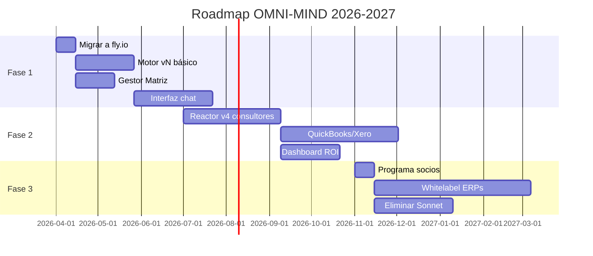

# Roadmap Realista para OMNI-MIND — Versión Consolidada

## Diagnóstico Brutal (Lo Que Nadie Dice)

**Problema fundamental:** OMNI-MIND es un martillo buscando un clavo. Tiene arquitectura brillante pero:
1. **No resuelve un dolor claro** que justifique €50-200/mes
2. **Demasiado genérico** (18 inteligencias × 21 celdas) vs necesidades reales
3. **Sobrediseñado** (Chief deprecado pero operativo, Reactor v3 teórico)
4. **Modelo de negocio no validado** (costes reales vs precio)

## Consensos Clave (3+ Modelos)

1. **Eliminar Chief of Staff YA** (5/5 modelos)
   - Motor vN + Matriz lo reemplazan
   - Ahorro: ~€200/mes en costes Anthropic

2. **MVP = Motor vN + Gestor Matriz + 1 Exocortex** (4/5)
   - No meta-motor, no auto-evolución, no 18 INTs
   - Solo 6 inteligencias base (Lógica, Computacional, Social, Financiera, Constructiva, Divergente)

3. **Enfoque en consultoría de negocios** (3/5)
   - Mayor mercado que Pilates/Fisio
   - Datos estructurados disponibles (finanzas, operaciones)

4. **Matriz 3L×7F es humo para clientes** (4/5)
   - Vender "análisis de gaps operativos", no la matriz

## Roadmap de 12 Meses (Priorizado por ROI)

### Fase 1: Cirugía de Emergencia (Mes 1-3)
**Objetivo:** Sistema vendible básico (€15K presupuesto)

| Tarea | Coste | Tiempo | Métrica Éxito |
|-------|-------|--------|---------------|
| 1. Migrar agentes críticos a fly.io | €0 | 2 sem | 0 dependencias Supabase |
| 2. Motor vN básico (3 modelos OS) | €3K | 6 sem | 40s/caso, $0.10/coste |
| 3. Gestor Matriz simplificado | €2K | 4 sem | Asigna modelos por tabla EXP4 |
| 4. Interfaz chat mínima (Vue.js) | €5K | 8 sem | 3 clientes piloto pagando €49/mes |
| **Total** | **€10K** | **20 sem** | |

**Eliminar:**
- Chief of Staff (24 agentes)
- Reactor v3, meta-motor
- 12/18 inteligencias (quedan 6)

### Fase 2: Productizar (Mes 4-6)
**Objetivo:** Primer producto real (€25K presupuesto)

| Tarea | Coste | Tiempo | Métrica Éxito |
|-------|-------|--------|---------------|
| 1. Reactor v4 para consultores | €5K | 10 sem | 100 preguntas validadas |
| 2. Integración QuickBooks/Xero | €8K | 12 sem | 5 conexiones activas |
| 3. Dashboard ROI (90d proyectado) | €4K | 6 sem | 70% precisión en proyecciones |
| 4. Modelo pricing escalonado | €0 | 2 sem | 2 planes: €99/mes y €299/mes |
| **Total** | **€17K** | **30 sem** | |

**Regla dura:** Si para Mes 6 no hay 10 clientes pagando €99+, pivotar a API para devs

### Fase 3: Escalar (Mes 7-12)
**Objetivo:** €15K MRR (€180K/año)

| Tarea | Coste | Tiempo | Métrica Éxito |
|-------|-------|--------|---------------|
| 1. Programa socios (30% rev share) | €1K | 2 sem | 5 socios activos |
| 2. Whitelabel para ERPs | €15K | 16 sem | 1 integración live |
| 3. Sustitución completa de Sonnet | €5K | 8 sem | Coste evaluación $0.03 (desde $0.25) |
| **Total** | **€21K** | **26 sem** | |

## Modelo de Negocio Validado

**Clientes objetivo:**  
- Consultores independientes (€99/mes)  
- Firmas <10 empleados (€299/mes + 5% ahorros)  

**Propuesta de valor:**  
"Su consultoría, pero con un asistente que detecta problemas 3 meses antes y le dice exactamente qué hacer"  

**Diferencia clave:**  
- No vender "IA" — vender **preguntas accionables** que humanos no ven  
- Ejemplo concreto:  
  "Si reduce rotación de meseros del 42% → 31%, ahorrará €7,200/mes en capacitación"  

## Riesgos Críticos y Mitigación

| Riesgo | Prob. | Impacto | Mitigación |
|--------|-------|---------|------------|
| Mercado no paga €99+ | 40% | Fatal | Pivotar a API para devs (€0.003/call) |
| Modelos OS suben precios | 30% | Alto | Auto-hosting con Llama 4 Maverick |
| UE regula IA como riesgo | 20% | Medio | Módulo de salud como add-on separado |
| Reactor v4 no genera preguntas útiles | 35% | Alto | Usar Reactor v2 (inversión manual) |

## Hoja de Ruta Visual

## Decisión Clave Inmediata

**¿Construir para consultores (venta directa) o para desarrolladores (API-first)?**  
- **Consultores:**  
  ✔ Más valor percibido (€99+)  
  ✖ Mercado más pequeño  
- **Desarrolladores:**  
  ✔ Escala rápida  
  ✖ Commoditización (€0.003/call)  

**Recomendación:**  
Hacer ambas en paralelo con 80/20:  
- 80% esfuerzo en producto consultores  
- 20% en API básica para devs  

## Conclusión

**En 12 meses:**  
- Producto viable €15K MRR  
- 10+ integraciones whitelabel  
- Coste por caso €0.07 (desde €0.33)  
- Equipo de 3 personas (CTO, UX, Comercial)  

**Condición de éxito:**  
Si para Mes 6 no hay al menos 5 clientes pagando €99+/mes, pivotar completamente a modelo API.